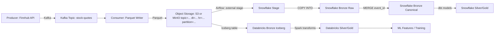

# Real-Time Stock Market Data Pipeline

## Overview
This project is an end-to-end data engineering solution designed to ingest, process, and visualize high-frequency stock market data in real-time. It demonstrates a **Lambda Architecture** approach, utilizing **Apache Kafka** for streaming ingestion and **Snowflake** for robust warehousing and analytics.

The goal of this project was to simulate a production-grade environment where data reliability, scalability, and latency are critical factors.


## Architecture


The pipeline consists of the following stages:
1.  **Ingestion:** Python scripts fetch real-time data from financial APIs.
2.  **Streaming:** **Apache Kafka** acts as the high-throughput message broker to buffer and decouple data producers from consumers.
3.  **Orchestration:** **Apache Airflow** (running in Docker) manages the workflow dependencies and scheduling.
4.  **Storage (Data Lake):** Raw JSON events are archived in an **MinIO S3** bucket for durability and replayability.
5.  **Warehousing:** Data is loaded into **Snowflake** (Raw Layer).
6.  **Transformation:** **dbt (data build tool)** performs modular transformations to move data from *Raw* to *Cleaned* to *Business Ready* (Medallion Architecture).
7.  **Visualization:** **Power BI** connects to the serving layer for near real-time dashboards.

## Why This Architecture

This architecture was intentionally designed to balance low-latency ingestion, reliability, replayability, and analytical performance, which are common requirements in production data platforms.

Kafka → Object Storage → Snowflake was chosen over direct streaming into the warehouse to create a durable, replayable landing zone. Persisting events in S3/MinIO decouples ingestion from consumption, allowing safe reprocessing, backfills, and downstream system changes without re-hitting external APIs.

A Medallion Architecture (Bronze / Silver / Gold) in Snowflake separates raw data ingestion from business logic, improving data quality, governance, and long-term maintainability. This approach also enables independent scaling and ownership of ingestion, transformation, and analytics layers.

The pipeline favors idempotent, batch-oriented loads (COPY INTO + MERGE) over continuous micro-batching into Snowflake. This reduces cost, avoids warehouse contention, and provides deterministic recovery behavior during failures or replays—an intentional tradeoff accepting slightly higher latency for operational stability.

Airflow orchestrates workflows, but does not perform transformations. Heavy data processing is pushed down to Snowflake and dbt, aligning with cloud data warehouse best practices and minimizing orchestration complexity.

Finally, the system prioritizes data correctness over raw speed. Schema validation, DLQs, quarantine paths, and replay mechanisms ensure bad data does not silently corrupt analytical tables—reflecting real-world reliability requirements in financial and analytics platforms.

## Tech Stack
* **Language:** Python 3.12+
* **Containerization:** Docker & Docker Compose
* **Orchestration:** Apache Airflow
* **Streaming:** Apache Kafka & Zookeeper
* **Data Lake:** AWS S3
* **Data Warehouse:** Snowflake
* **Transformation:** dbt Core
* **BI/Visualization:** Power BI

## Key Features
* **Containerized Environment:** The entire infrastructure (Airflow, Kafka, Zookeeper) is defined in `docker-compose.yml` for reproducible deployments.
* **Medallion Architecture:** Implements a structured data flow (Bronze/Silver/Gold) within Snowflake to ensure data quality and governance.
* **Fault Tolerance:** Kafka acts as a buffer to handle backpressure and prevent data loss during API spikes.
* **Infrastructure as Code:** All warehouse tables and pipes are managed via SQL scripts and dbt models.

## Setup & Installation

### Prerequisites
* Docker Desktop installed
* AWS Account (S3 access)
* Snowflake Account
* Python 3.9+

### Running the Pipeline
1.  **Clone the repository:**
    ```bash
    git clone [https://github.com/Alx-Lopez/stock-market-pipeline.git](https://github.com/Alx-Lopez/stock-market-pipeline.git)
    cd stock-market-pipeline
    ```

2.  **Configure Credentials:**
    Create a `.env` file containing your API keys and Snowflake credentials:
    ```env
    AWS_ACCESS_KEY=...
    SNOWFLAKE_USER=...
    API_KEY=...
    ```

3.  **Start Services:**
    Spin up the Docker containers for Airflow and Kafka:
    ```bash
    docker-compose up -d
    ```

4.  **Trigger the DAG:**
    Access the Airflow UI at `http://localhost:8080` and enable the `stock_data_ingestion` DAG.

## Future Improvements
* Implement **Spark Streaming** for complex windowed aggregations before loading to Snowflake.
* Add **Great Expectations** for more granular data quality testing within the Airflow DAG.
* Integrate CI/CD using GitHub Actions for automated dbt testing.
* Store Kafka events in S3 as partitioned Parquet/Avro with deterministic offset buckets, compression, and compaction to manage small files.
* Look to Deploy in Cloud Solution  

## Near-Real-Time Defaults
Set these in `ifra/.env` to target ~15s end-to-end latency:
```
S3_BASE_PREFIX=
PARQUET_COMPRESSION=snappy
BATCH_SIZE=500
MAX_BATCH_SECONDS=10
MAX_BATCH_BYTES=1048576
OFFSET_BUCKET_SIZE=500
MAX_BUCKET_SECONDS=15
```
Tradeoff: lower latency means smaller files. Plan to run periodic compaction to keep query performance healthy.
Dependencies: the compaction script and any downstream querying expect the partitioned layout `topic=<t>/dt=YYYY-MM-DD/hr=HH/partition=<p>/` and deterministic `start=<offset>_end=<offset>.parquet` filenames.

## Idempotent Load Design (Snowflake)
To make the pipeline idempotent end-to-end:
- Producer emits a deterministic `event_id` and `source_system` per event.
- Airflow loads files into a Snowflake stage, copies into a raw bronze table with `load_ts` and `file_name` lineage, then `MERGE`s into a canonical bronze table keyed by `event_id` + `source_system`.
- The merge deduplicates by keeping the latest `load_ts` per event key.

## Schema Validation and Data Quality
- Ingestion validates events against `ifra/consumer/schema/stock_quote.schema.json` (path is resolved relative to the repo); invalid events are sent to a DLQ prefix (default `dlq/`).
- Configure validation via `SCHEMA_VALIDATION_ENABLED`, `SCHEMA_FILE`, `DLQ_PREFIX`, and `QUARANTINE_PREFIX`.
- dbt enforces contracts/tests on the bronze staging model (`not_null`, `unique`, `accepted_values`) to catch schema drift.

## Bad Data Paths (DLQ + Quarantine + Replay)
- Invalid events are published to a Kafka dead-letter topic (`KAFKA_DLQ_TOPIC`) and written to object storage under `dlq/` and `quarantine/`.
- Replay quarantined records by running `python real-time-data-mds/ifra/scripts/replay_quarantine.py` with:
  - `REPLAY_MODE=kafka` (default) and `REPLAY_TOPIC`, or
  - `REPLAY_MODE=s3` and `REPLAY_S3_PREFIX` to re-land into storage.
- `REPLAY_HOURS` limits replay to the last N hours (set `0` to replay everything).
- Airflow automation: enable the `replay_quarantine` DAG to replay once per hour.

## Databricks + Iceberg Roadmap
- Keep current Parquet landing as Bronze; introduce Iceberg tables on S3 for ML/feature work in Spark.
- Create Iceberg Bronze over the existing partitioned layout, then build Silver/Gold tables for model features.
- Databricks SQL notebook stub: `real-time-data-mds/databricks/iceberg_bronze.sql`.
- Migration plan (MinIO → S3 + Glue/Iceberg catalog): `real-time-data-mds/docs/minio_to_s3_iceberg_plan.md`.
 - Silver notebook: `real-time-data-mds/databricks/iceberg_silver.sql`
 - Gold features (1h horizon): `real-time-data-mds/databricks/iceberg_gold_features.sql`
 - Gold star schema (fact + dims): `real-time-data-mds/databricks/iceberg_gold_star.sql`

## Pipeline Diagram (Snowflake + Databricks)


## Local S3 with IAM Role
- Setup guide: `real-time-data-mds/docs/local_s3_from_local.md`
- Profile helper: `real-time-data-mds/scripts/aws_role_profile_setup.sh`
## Snowflake External Stage (No AWS Keys in Airflow)
- Guide: `real-time-data-mds/docs/snowflake_storage_integration.md`
## Orchestration Boundaries (Airflow vs Snowflake vs dbt)
- Airflow: scheduling, dependency mgmt, retries, backfills, alerting
- Snowflake: bulk load + set-based operations (COPY/MERGE), optional Tasks/Streams for incremental loads
- dbt: transformations, tests, docs
- Tasks/Streams template: `real-time-data-mds/docs/snowflake_tasks_streams.md`
## Observability & SLAs
- Freshness, anomalies, and lineage plan: `real-time-data-mds/docs/observability.md`
## Snowflake Performance
- Optimization guide: `real-time-data-mds/docs/snowflake_optimization.md`
## Governance & Security
- Quick wins guide: `real-time-data-mds/docs/governance_security.md`
## dbt Docs & Exposures
- Run `dbt docs generate` and `dbt docs serve` from `real-time-data-mds/dbt_stocks`
- Exposures defined in `real-time-data-mds/dbt_stocks/models/gold/exposures.yml`

## Producer Direct to S3 (Optional)
- Script: `real-time-data-mds/ifra/producer/producer.py` (set `DIRECT_TO_S3=true`)
- Env: set `S3_BUCKET`, and (optionally) `AWS_PROFILE`/`AWS_REGION`; set `USE_MINIO=true` only if you want to write to MinIO via `MINIO_ENDPOINT_URL`.
- Run from `real-time-data-mds/ifra/producer`: `DIRECT_TO_S3=true uv run python producer.py`

## Troubleshooting Notes
### Challenges Faced
- Kafka local connectivity required correct advertised listeners and using `localhost:29092` from host processes.
- Airflow webserver failures due to a stale PID file when Gunicorn did not shut down cleanly.
- Airflow tasks couldn't read local `.env` until it was mounted inside the containers.
- MinIO endpoint needed Docker service DNS (`http://minio:9000`) instead of `localhost` when running inside Airflow.
- Snowflake permissions blocked dbt models on schema `COMMON` until grants were applied for the role in use.
- dbt source/model parsing errors caused by YAML formatting and incorrect `source()` Jinja syntax.
- JSON field names in `bronze_stock_quotes_raw` did not match model expectations, producing NULLs.
- Kafka hot partition can be avoided by using round-robin partitioning (no key) or by increasing key cardinality.
- To reset a topic, delete and recreate it with the desired partition count using `kafka-topics`.
- Slow consumer throughput can be caused by small batch sizes, frequent flushes, single-partition topics, slow S3/MinIO writes, or low local resources (CPU/disk).
- If all messages land in partition 0, the topic likely has only 1 partition; recreate it with more partitions and keep a non-empty key (salted if needed).
- If the topic has multiple partitions but all records still land in partition 0, remove the producer key to use round-robin, or increase key cardinality.
- If round-robin still lands on one partition, the topic likely has only 1 partition or the producer wasn't restarted after config changes.
- Kafka will return “topic already exists” when recreating; use `--alter` to increase partitions, or delete the topic first (partition count cannot be decreased).
- Airflow tasks must use the Docker service DNS for MinIO (`http://minio:9000`), not `localhost`, to avoid connection refused errors.
- Use `ifra/.env.docker` for containers and `ifra/.env.local` for running producers/consumers on your host.
- Snowflake load can fail with `invalid identifier 'LOAD_TS'` if older tables were created without new columns; the DAG now adds missing columns automatically.
- To clear the Snowflake stage manually, run `python real-time-data-mds/ifra/scripts/clear_snowflake_stage.py`.
- To purge old JSON files in an internal stage: `ENV_FILE=real-time-data-mds/ifra/.env.local STAGE_PATTERN='.*\\.json' python real-time-data-mds/ifra/scripts/clear_snowflake_stage.py`.
- S3 `NoSuchBucket` errors are often caused by using MinIO endpoint vars with AWS; set `USE_MINIO=false` and clear `MINIO_ENDPOINT_URL` in `.env.local`.
- `ProfileNotFound` means your AWS CLI profile doesn’t exist; create it or leave `AWS_PROFILE` empty to use the default profile.
- Env files are consolidated to `ifra/.env.local`, `ifra/.env.docker`, and `ifra/.env.example` only; `producer.py` and `consumer.py` auto-pick the right one.
- Snowflake loads now use an external S3 stage (no download step); set `SNOWFLAKE_STAGE_URL` and either `SNOWFLAKE_STORAGE_INTEGRATION` or `AWS_ACCESS_KEY_ID`/`AWS_SECRET_ACCESS_KEY`.
- Snowflake 404 login errors usually mean `SNOWFLAKE_ACCOUNT` is still a placeholder (e.g., `your-snowflake-account`) in `.env.docker` or the wrong account locator is set.


### Important Commands
- Docker services:
  - `docker compose up -d zookeeper kafka`
  - `docker compose up -d --force-recreate airflow-webserver airflow-scheduler airflow-init`
  - `docker compose logs --tail 200 airflow-webserver`
- Airflow (stale PID cleanup):
  - `docker compose exec airflow-webserver rm -f /opt/airflow/airflow-webserver.pid`
  - `docker compose restart airflow-webserver`
- Airflow user creation:
  - `docker compose exec airflow-webserver airflow users create --username admin --firstname ### --lastname ### --role Admin --email a@example.com --password <password>`
- dbt (local profile):
  - `cd real-time-data-mds/dbt_stocks`
  - `set -a; source ../ifra/.env; set +a`
  - `dbt run`
  - `dbt run --debug`
- Snowflake grants for `COMMON` schema (run as admin role):
  - `GRANT USAGE ON DATABASE STOCKS_MDS TO ROLE PUBLIC;`
  - `GRANT USAGE ON SCHEMA STOCKS_MDS.COMMON TO ROLE PUBLIC;`
  - `GRANT CREATE TABLE ON SCHEMA STOCKS_MDS.COMMON TO ROLE PUBLIC;`
  - `GRANT CREATE VIEW ON SCHEMA STOCKS_MDS.COMMON TO ROLE PUBLIC;`
  - `GRANT SELECT, INSERT, UPDATE, DELETE ON ALL TABLES IN SCHEMA STOCKS_MDS.COMMON TO ROLE PUBLIC;`
  - `GRANT SELECT, INSERT, UPDATE, DELETE ON FUTURE TABLES IN SCHEMA STOCKS_MDS.COMMON TO ROLE PUBLIC;`
  - `GRANT USAGE ON ALL STAGES IN SCHEMA STOCKS_MDS.COMMON TO ROLE PUBLIC;`
  - `GRANT USAGE ON FUTURE STAGES IN SCHEMA STOCKS_MDS.COMMON TO ROLE PUBLIC;`


### Keywords
data engineering, real-time data pipeline, streaming data, kafka, snowflake,
dbt, airflow, python, s3, data lake, data warehouse, medallion architecture,
incremental models, idempotent ingestion, analytics engineering